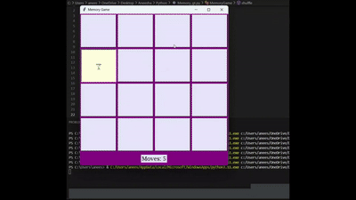

# 🧠 Memory Game (Tkinter)

A simple yet addictive **Memory / Matching card game** built with Python and Tkinter. Flip cards, find matching pairs, and challenge yourself to complete the game in as few moves as possible!  

Perfect for beginners learning **Python GUI programming** or anyone who enjoys a quick brain teaser.  


## 🌟 Features

- **Classic 4×4 memory grid** with shuffled emoji cards  
- **Move counter** to track your performance  
- **Instant feedback**: matches highlight in green, mismatches return to closed cards  
- **End screen** showing your total moves  
- **Replayable** with a **Play Again** button  
- Beginner-friendly **Python & Tkinter code**, easy to read and modify
  

## 🎮 How to Play

1. Click on a card to reveal it.  
2. Click another card to find its match.  
3. If they match, they stay revealed (green highlight).  
4. If not, they flip back – try to remember their positions!  
5. Continue until all pairs are matched.  
6. Check your moves on the counter – can you beat your previous best?
   

## 🎥 Demo

  


## 🖼 Screenshots

**Start Screen**  


**Correct Match**  


**Wrong Match**  


**Game Completed**  


## 💻 Built With

- **Python 3.x** – Core programming language  
- **Tkinter** – For creating the GUI  
- **Random module** – To shuffle cards  

Optional: Any IDE or code editor for Python like **VS Code**, **PyCharm**, or **Sublime Text**  


## 🔮 Future Improvements

- **Larger grids** – 6×6 or 8×8 for a bigger challenge
- **Two Player Mode** - Allows multiple players to compete
- **Timer mode** – Track how fast players can complete the game  
- **Leaderboard** – Save high scores and fastest completion times  
- **Themes & Emojis** – Allow players to choose different card sets  
- **Sound effects & animations** – Add fun audio/visual feedback  
- **AI hint system** – Suggest possible matches for learning mode  


## 📚 Learning Outcomes

- Basic GUI programming with **Tkinter**  
- Python lists, loops, and conditional logic  
- Event-driven programming (button clicks, game state updates)  
- Fun way to practice Python while building a playable game


## 🎁 Bonus Tip

- **Memory Hack:** Try memorizing the positions of cards – your brain loves the workout!  
- **Challenge Mode:** Keep track of your moves and try to beat your previous score.  
- **Pro Tip:** Create your own “house rules” – like a time limit or limited hints – to make the game even more fun!


## 💻 Running Locally

1. Make sure **Python 3.x** is installed.  
2. Tkinter is usually included; if not, install it (`sudo apt-get install python3-tk` on Linux).  
3. Download or clone the repository:  
```bash 
git clone <repository_url> 
```
4.Navigate to the folder and run the game
python memory_game.py
 or
python3 memory_game.py

## 🤝 Contributions by Aneesha

This Memory Game was fully **designed, developed, and created by Aneesha Manjunath Iyer**, including all gameplay mechanics, visuals, and features. Ensured the game is **fun, interactive, and beginner-friendly**, and added the demo, screenshots, and bonus tips to enhance the player experience.  

  
