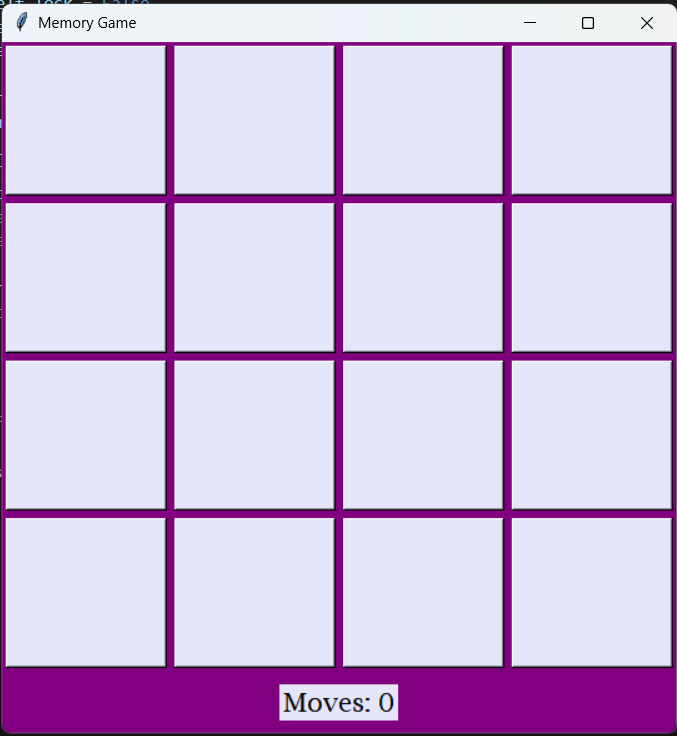
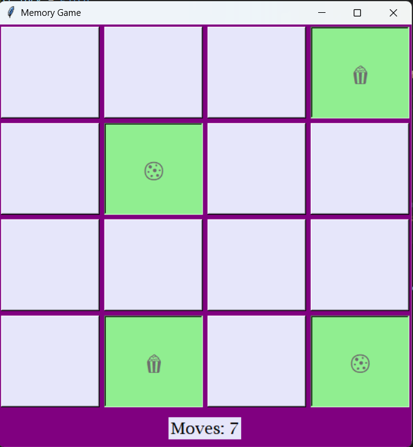
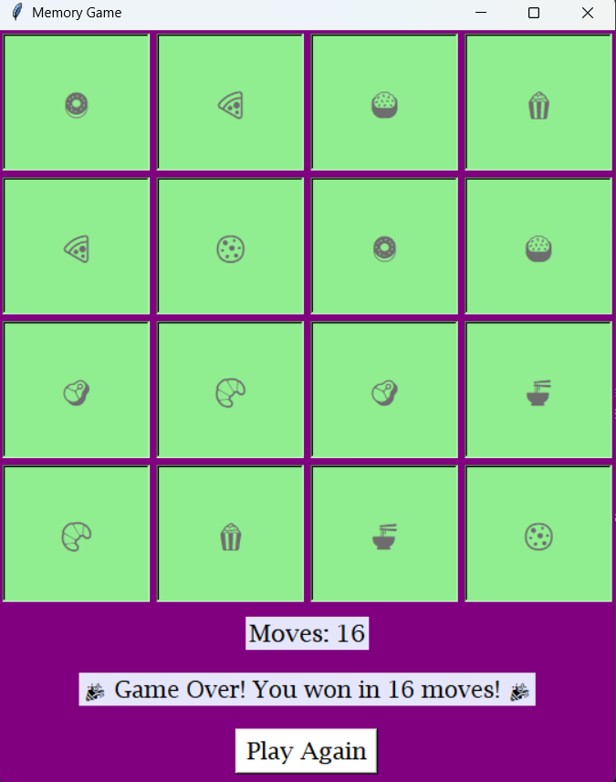

# 🧠 Memory Game (Tkinter)

A simple Memory / Matching card game built with Python and Tkinter.  
Flip cards, match pairs, and try to finish with as few moves as possible!

## Features
- 4×4 grid of shuffled emoji cards
- Move counter
- Matches highlight in green
- End screen with moves and **Play Again** button
- Simple, beginner-friendly code

## Screenshot





## How to run (locally)
1. Download the repository: **Code → Download ZIP**, then extract.
2. Make sure you have **Python 3.x** installed.
3. Run:
```bash
python memory_game.py
# or
python3 memory_game.py
